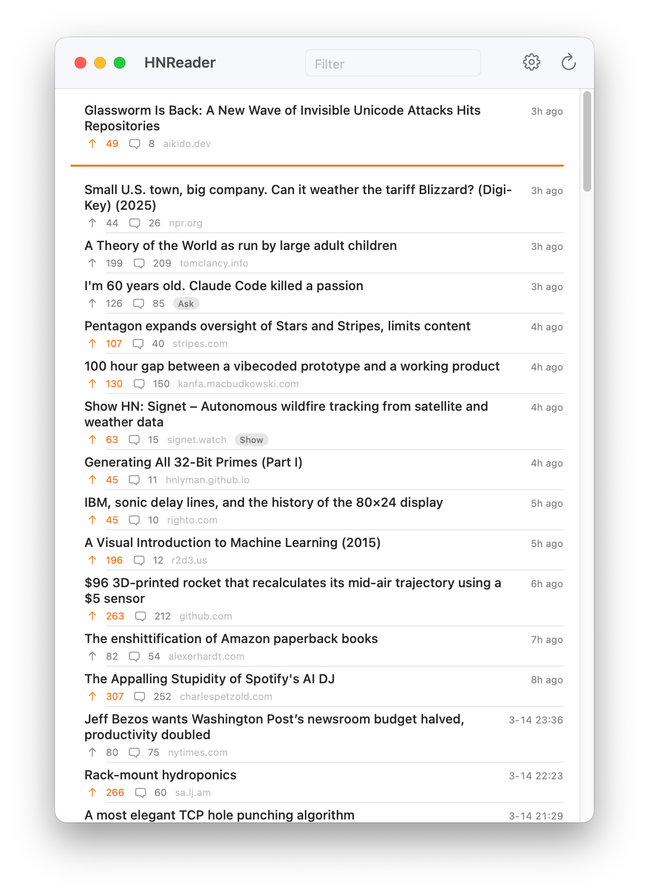

# HNReader

A native macOS app for browsing Hacker News stories in reverse-chronological order. Filters by minimum points, tracks unread stories between sessions. Read-only.

<p align="center">
  
</p>

## Install

### Homebrew

```sh
brew tap tbeseda/tap
brew install --cask hn-reader
```

### Manual

Download `HNReader.zip` from the [latest release](../../releases/latest), unzip, and move to `/Applications`.

The app is not signed. To open it for the first time, either:

- Run `xattr -cr /Applications/HNReader.app` in Terminal, then open normally
- Or attempt to open, then go to **System Settings > Privacy & Security**, scroll down, and click **Open Anyway**

## Usage

Stories load on launch and can be refreshed manually. A divider line separates new stories from previously seen ones. Background checks every 5 minutes update the dock badge with a count of new stories.

- Click a story title to open the link in your browser
- Click the comment count to open the HN discussion
- Adjust the minimum points filter in the toolbar

## Build from source

```
xcodebuild -project HNReader.xcodeproj -scheme HNReader -configuration Release build
```

Requires Xcode 26+ and macOS 15+.
